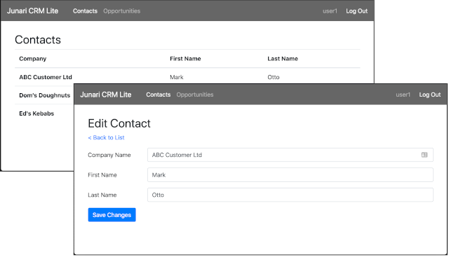

# Junari Technical Interview App

Welcome to Junari CRM Lite! This is a simple web application used in Junari
Technical interviews. It implements a basic CRM system that allows users to
edit contacts.



This application consists of a [Flask](https://github.com/pallets/flask) web
server with a JSON API, and a JavaScript front-end that uses the
[Odoo Web Library (OWL)](https://github.com/odoo/owl)
framework - a modern React/Vue-like framework.

## Requirements

* Python 3.7 or above
* A modern web browser (Chrome or Firefox recommended).
  The app uses JS modules and async functions.

## Setup

This projects uses **pipenv** to install its dependencies and for running scripts
- refer to the pipenv installation notes in the 
[README](https://github.com/pypa/pipenv/blob/master/README.md) for instructions on
installing it.

Once you have `pipenv` set up, check-out the repository onto your local machine

```bash
git clone git@github.com:junariltd/interview_app.git
cd interview_app
```

Now run the following commands to configure and run the project

```bash
# run these from within the interview_app folder

# create and launch a virtual environment for the project
pipenv shell

# install dependencies
pipenv install

# initialise database
pipenv run init-db

# start the dev server
pipenv run devserver
```

Once the dev server is started, the app can be accessed at http://localhost:5000/

The default user is **user1**, password: **letmein**

## Front-end code

The JavaScript front-end uses modern JavaScript and JS modules in the browser
and **does not require a build step**. The front-end code can be found in the
`jcrm_lite/static/js/` directory.

## Useful References

* [Flask Tutorial](https://flask.palletsprojects.com/en/1.1.x/tutorial/#tutorial)
* [Odoo Web Library Docs](https://github.com/odoo/owl/blob/master/doc/readme.md)
* [QWeb Template Language Docs](https://github.com/odoo/owl/blob/master/doc/reference/qweb_templating_language.md)
* [Odoo Web Library Playground](https://odoo.github.io/owl/playground/)
